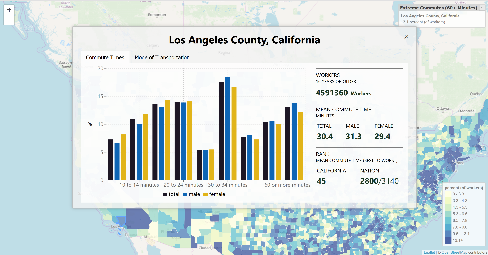

# US Commute Times (Version 2)

## Background

Personally, I've overheard and participated in a lot of discussions about places to live in California and the United States.
People always love to mention salaries, the exciting activities, and so on, they seem to ignore traffic. Knowing who I am, I
don't think I'd have the motivation to do much of anything after sitting in traffic for an hour or more every day. Hence, I made
a little tool using US Census data from the 2016 American Community Survey to help people like me make a more informed decision on
where they'd like to live.

### Version 1
This app is also a re-write of a [vanilla JavaScript project](https://github.com/vincentlaucsb/us-map) (warning: spaghetti code) that used a Python script to output a static HTML/JavaScript website.

## Tools Used

* Front-End
  * [React (TypeScript)](https://reactjs.org/)
    * [React Leaflet](https://react-leaflet.js.org/)
    * [recharts](https://github.com/recharts/recharts)
* Back-End
  * [Flask (Python)](https://flask.palletsprojects.com/en/1.1.x/)
  * [PostgreSQL](https://www.postgresql.org/)

## Directory Layout

* [backup](backup/) - A dump of the PostgreSQL database
* [flask](flask/) - The Flask app which exposes JSON endpoints for the React app
* [public](public/) - HTML templates for the React app
* [raw_data](raw_data/) - Original data for the project
* [src](src/) - The front-end React app
